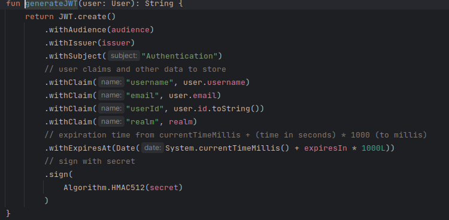

### Security

JWT token authentication was implemented in the project.

1. when a user logs in, a token is generated with the following informations:

2. some endpoints were locked, requiring the user, requesting the operation, to have a valid JWT token.
   1. both the **GET** and the **POST** endpoint **"/users"** requires a valid token to be used **+** the user must have a role of **ADMIN**
